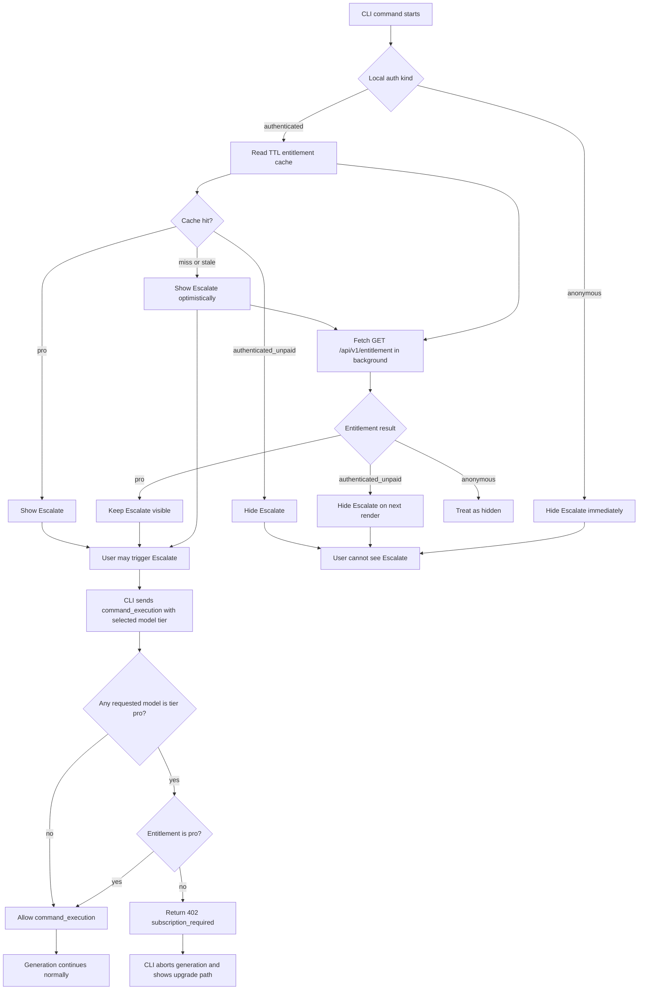

# CLI Pro Model Entitlement Guard

## Summary

Add entitlement-aware guarding for Pro-tier CLI model usage without adding blocking startup RTT to normal CLI execution.

The goal is to make Pro-tier models available only to Pro users, while preserving the current fast startup behavior for CLI commands such as `git ultrahope commit` and `ultrahope jj describe`.

## Owner

- Codex + satoshi

## Expected Completion Date

- 2026-03-13

## Next Action

- Completed. Follow-up work, if needed, should be tracked separately for cache invalidation refinements or model-catalog sharing.

## Product Policy

- Ultrahope models have two tiers:
  - `default`
  - `pro`
- `default` tier models are available to all CLI users.
- `pro` tier models require the Pro plan.
- CLI interactive commands use `default` tier models by default.
- When the user escalates from the selector UI, the CLI switches to `pro` tier models.
- Therefore, escalation requires the Pro plan.

## Scope

- `packages/web`
  - Add `GET /api/v1/entitlement`
  - Enforce Pro-tier model access in `command_execution`
  - Update OpenAPI and tests
- `packages/cli`
  - Add local entitlement cache with TTL
  - Resolve entitlement in the background for authenticated users
  - Hide `Escalate` in the selector when entitlement resolves to `authenticated_unpaid`
  - Keep anonymous users from seeing `Escalate` immediately

## Source Of Truth

### Model Policy

- Server-side model tier metadata is the source of truth for whether a model is `default` or `pro`.
- Initial implementation can keep this metadata in `packages/web/lib/llm/models.ts`.

### Entitlement Policy

- Server-side entitlement is the source of truth for whether a user is:
  - `anonymous`
  - `authenticated_unpaid`
  - `pro`

### Enforcement Point

- Server-side enforcement happens in `command_execution` only.
- The current flow already depends on successful `command_execution` setup before generation should proceed.
- If `command_execution` fails, generation is aborted through the existing orchestration path.

## High-Level Architecture



## Responsibility Split

| Layer | Responsibility | Notes |
|---|---|---|
| Web model metadata | Define model tier (`default` or `pro`) | Source of truth for gating |
| Web entitlement endpoint | Return current entitlement | Used for CLI UX only |
| Web `command_execution` route | Enforce Pro-tier access | Hard security boundary |
| CLI entitlement cache | Reduce repeat RTT | UX optimization only |
| CLI selector | Reflect current `canEscalate` capability | No policy authority |

## Model Tier Design

### Intended shape

```ts
type ModelTier = "default" | "pro";
```

Example direction:

```ts
{
  id: "mistral/ministral-3b",
  tier: "default",
}

{
  id: "openai/gpt-5.3-codex",
  tier: "pro",
}
```

### Why tier-based gating

- Current escalation behavior is effectively "use a stronger model", not a separate API mode.
- Model-tier-based policy also covers direct model selection such as `--models ...`.
- This avoids introducing a separate request flag only for escalation.

## API Design

### Entitlement Endpoint

```http
GET /api/v1/entitlement
```

Response:

```json
{ "entitlement": "anonymous" | "authenticated_unpaid" | "pro" }
```

### Error Behavior

- If a non-Pro user requests any `pro` tier model through CLI command execution:
  - return `402`
  - return existing `subscription_required`
- This applies to:
  - `authenticated_unpaid`
  - `anonymous`

Rationale:

- Keep the first implementation simple.
- Reuse existing upgrade/subscription handling.

## CLI State Model

Current CLI local auth remains unchanged:

- `anonymous`
- `authenticated`

`authenticated_unpaid` is not promoted to a persistent CLI auth state.
It remains:

- a server-side entitlement result
- a short-lived local cache value used for UX decisions

## Selector Update Strategy

The selector ViewModel should remain structurally unchanged.

Instead:

- the selector should receive capabilities dynamically
- render-time capability resolution should determine whether `Escalate` is shown
- key handling should consult the latest capability value when practical

Design intent:

- do not add a new selector state machine branch for entitlement
- do not force complex synchronization between background fetch completion and current keypresses
- if the user races into escalation before UI updates, allow the request and rely on server rejection

## Local Cache Design

### Storage

- Separate from credentials
- Suggested path:
  - `~/.config/ultrahope/entitlement-cache.json`

### Cache behavior

- Only relevant for authenticated users
- Anonymous users should hide `Escalate` immediately without cache lookup
- Cache miss or stale cache:
  - optimistic `Escalate` visible
  - background fetch refreshes state
- Fresh `authenticated_unpaid` cache:
  - hide `Escalate`
- Fresh `pro` cache:
  - show `Escalate`

### Cache invalidation

- TTL-based only for now
- Accept temporary misclassification as a deliberate tradeoff
- Future improvement may add a cache-clearing command such as `ultrahope auth cache clear`

## UX Rules

| User state | Initial UI behavior | Background fetch | Final behavior |
|---|---|---|---|
| `anonymous` | Hide `Escalate` immediately | None required | Hidden |
| `authenticated` + fresh `pro` cache | Show `Escalate` | Optional refresh | Visible |
| `authenticated` + fresh `authenticated_unpaid` cache | Hide `Escalate` | Optional refresh | Hidden |
| `authenticated` + cache miss/stale | Show `Escalate` optimistically | Required | Hide if result is `authenticated_unpaid`, otherwise keep visible |

## Data Flow

```text
CLI auth kind
├── anonymous
│   └── canEscalate = false
└── authenticated
    ├── read local entitlement cache
    ├── set initial canEscalate from cache or optimistic default
    ├── fetch /api/v1/entitlement in background
    └── update canEscalate after response arrives
```

## Implementation Outline

```tree
packages/
├── web/
│   ├── lib/llm/models.ts
│   │   └── add model tier metadata and helpers
│   ├── lib/api/routes/
│   │   ├── entitlement.ts
│   │   └── command-execution.ts
│   │       └── reject pro-tier model usage for non-Pro users
│   ├── lib/api/shared/
│   │   ├── validators.ts
│   │   └── errors.ts
│   └── lib/api/api.routes.test.ts
└── cli/
    ├── lib/
    │   ├── entitlement-cache.ts
    │   ├── api-client.ts
    │   └── selector.ts
    └── commands/
        ├── commit.ts
        └── jj.ts
```

## Acceptance Criteria

- [x] Server defines model tier metadata with `default` and `pro`
- [x] `GET /api/v1/entitlement` returns `anonymous`, `authenticated_unpaid`, or `pro`
- [x] `command_execution` rejects Pro-tier model requests from non-Pro users with `402 subscription_required`
- [x] CLI anonymous users do not see `Escalate`
- [x] CLI authenticated users use local entitlement cache when available
- [x] CLI authenticated users fetch entitlement in the background without blocking startup
- [x] Selector can hide `Escalate` after background entitlement resolution without changing the shared ViewModel contract
- [x] Existing generation abort path remains the mechanism for stopping execution after `command_execution` failure
- [x] Documentation explains model tiers, Pro-tier access, and why escalation requires Pro

## Test Plan

### Web

- [x] Add tests for `GET /api/v1/entitlement`
  - anonymous session returns `anonymous`
  - authenticated unpaid session returns `authenticated_unpaid`
  - Pro session returns `pro`
- [x] Add tests for `command_execution`
  - `default` tier models allowed for anonymous users
  - `pro` tier models rejected for anonymous users
  - `pro` tier models rejected for authenticated unpaid users
  - `pro` tier models allowed for Pro users

### CLI

- [x] Add cache tests
  - fresh `pro` cache enables `Escalate`
  - fresh `authenticated_unpaid` cache disables `Escalate`
  - stale cache triggers background refresh path
- [x] Add selector capability tests
  - anonymous initial render hides `Escalate`
  - authenticated optimistic render shows `Escalate`
  - background entitlement resolution can remove `Escalate` from later renders

## Execution Notes

- Added Web-side model tier metadata and used it to gate Pro-tier model requests in `command_execution`.
- Added `GET /api/v1/entitlement`, updated OpenAPI, and covered the entitlement and command-execution matrix in API route tests.
- Added CLI entitlement cache and background entitlement resolution, then wired selector capabilities so `Escalate` visibility updates without changing the shared selector contract.
- Updated CLI documentation to explain `default` / `pro` model tiers and that escalation requires Pro.

## Validation

- Verified the task acceptance criteria against the current codebase and updated the checklist to reflect shipped behavior.
- Ran `mise run format` successfully after updating the task record.

## Open Questions

- Should model tier metadata remain Web-local, or be moved into `packages/shared` later if the CLI starts depending on the same catalog directly?
- Should CLI update entitlement cache immediately when it receives `subscription_required`, in addition to normal TTL refresh?
