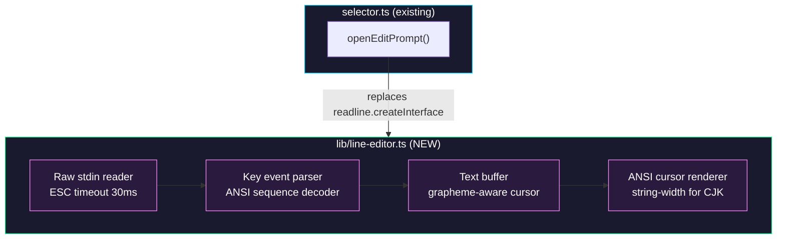

# Epic: Codex-like Inline Editor for Ultrahope CLI

> **Scope:** `opensrc/repos/github.com/toyamarinyon/ultrahope/packages/cli`

## Goal

Replace the current `readline.createInterface`-based inline edit prompt in Ultrahope's
`selectCandidate()` with a custom raw-mode line editor that provides:

- **Instant Escape key response** (no 500ms ESCDELAY from `readline.emitKeypressEvents`)
- **Full Emacs keybindings** (Ctrl+A/E/B/F/K/U/W/Y/D/H/P/N)
- **CJK-aware cursor positioning** using `string-width` for fullwidth characters
- **Grapheme-cluster-safe movement** using `Intl.Segmenter`

The result is a commit-message editing experience comparable to `codex-rs/tui`'s `TextArea`,
implemented in pure TypeScript with zero new runtime dependencies beyond `string-width`.

## Why

The current `openInlinePrompt()` in `selector.ts` delegates to `readline.createInterface()`.
This has two problems:

- **Escape delay**: `readline.emitKeypressEvents` waits ~500ms after receiving `0x1B` to
  disambiguate standalone Escape from ANSI escape sequences. This makes "Escape to cancel"
  feel sluggish.
- **CJK cursor drift**: `readline` does not account for fullwidth character display widths
  when computing cursor column positions. Japanese/Chinese characters cause the visible
  cursor to desync from the logical position.

Benefits of the new approach:
- Escape responds in <50ms (configurable timeout, default 30ms)
- CJK characters render with correct cursor alignment
- Emacs keybindings work identically to codex-rs/tui's TextArea
- No new frameworks — pure `process.stdin` raw mode + ANSI escape sequences

## Architecture Overview



## Package / Directory Structure

```
packages/cli/
├── lib/
│   ├── line-editor.ts          # NEW — core line editor module
│   ├── line-editor.test.ts     # NEW — unit tests
│   ├── selector.ts             # EXISTING — modify openInlinePrompt()
│   └── ...
├── package.json                # EXISTING — add string-width dependency
└── ...
```

## Task Dependency Graph


## Task Status

| Phase | Task File | Status | Description |
|---|---|---|---|
| 0 | [phase-0-line-editor-core.md](./phase-0-line-editor-core.md) | 🔲 TODO | Build the raw-mode line editor with Emacs keybindings and CJK support |
| 1 | [phase-1-selector-integration.md](./phase-1-selector-integration.md) | 🔲 TODO | Replace `readline.createInterface` in `openInlinePrompt` with the new editor |

> **How to work on this epic:** Read this file first to understand the full architecture.
> Then check the status table above. Pick the first `🔲 TODO` task whose dependencies
> (see dependency graph) are `✅ DONE`. Open that task file and follow its instructions.
> When done, update the status in this table to `✅ DONE`.

## Key Conventions

- Runtime: Bun (see `mise.toml`)
- Build: `tsup` (see `tsup.config.ts`)
- Formatter/Linter: Biome (`biome.json` at repo root)
- Format command: `mise run format`
- TypeScript: strict mode, ESM (`"type": "module"`)
- Zero-dependency philosophy: only `string-width` is added; no frameworks
- Existing raw-mode pattern: `selector.ts` already uses `ttyReader.setRawMode(true)` +
  `readline.emitKeypressEvents()` for the list view — the new editor replaces only the
  prompt/edit path

## Existing Code Reference

| File | Relevance |
|---|---|
| `packages/cli/lib/selector.ts` L487–L565 | Current `openInlinePrompt()` — the code being replaced |
| `packages/cli/lib/selector.ts` L596–L622 | `openEditPrompt()` — the caller that passes `initialValue` and `cancelOnEscape` |
| `packages/cli/lib/selector.ts` L472–L485 | `withPromptSuspended()` — how raw mode is toggled around prompts |
| `packages/cli/lib/selector.ts` L641–L719 | `handleKeypress()` — existing key handling in list mode |
| `packages/cli/lib/renderer.ts` | Existing ANSI rendering helpers |
| `packages/cli/lib/ui.ts` | UI formatting utilities (hint text, prompt styling) |
| `packages/shared/terminal-selector-contract.ts` | Selector type definitions |
| `opensrc/.../codex-rs/tui/src/bottom_pane/textarea.rs` | Reference implementation: Emacs keybindings, grapheme movement, unicode-width cursor |
| `opensrc/.../codex-rs/tui/src/tui.rs` L62–L83 | Reference: `DISAMBIGUATE_ESCAPE_CODES` keyboard enhancement |

## Design Decisions

### Escape Sequence Parsing Strategy

Use a **short timeout (30ms)** approach rather than Kitty keyboard protocol:
- Kitty protocol (`DISAMBIGUATE_ESCAPE_CODES`) would require writing `\x1b[>1u` to stdout
  and parsing the extended `CSI u` response format — but the selector's list-mode keypress
  handler still uses `readline.emitKeypressEvents()`, so enabling Kitty protocol globally
  would break that path.
- The 30ms timeout is the pragmatic choice: it's fast enough to feel instant, and handles
  all terminal emulators without protocol negotiation.

### Grapheme Segmentation

Use `Intl.Segmenter` (built into Node/Bun, no dependency needed) instead of the
`unicode-segmentation` crate that codex-rs uses. This handles emoji, combining characters,
and CJK correctly.

### Key Event Model

The parser produces a simple `KeyEvent` type:

```typescript
interface KeyEvent {
  key: string;          // "a", "escape", "return", "up", "down", "left", "right", "backspace", "delete", "tab"
  ctrl: boolean;
  alt: boolean;
  shift: boolean;
}
```

This mirrors codex-rs's `crossterm::event::KeyEvent` but simplified for our single-line use case.
