# Phase 0: Line Editor Core

> **Epic:** [AGENTS.md](./AGENTS.md)
> **Dependencies:** None
> **Blocks:** Phase 1

## Objective

Build a self-contained, single-line text editor module (`lib/line-editor.ts`) that operates
in raw mode with its own ANSI escape sequence parser, Emacs keybindings, and CJK-aware
cursor rendering. This module exposes a single `editLine()` function that returns a Promise
resolving to the edited string (or `null` on cancel).

## What You're Building

```mermaid
flowchart TD
    editLine["editLine(options)\nreturns Promise&lt;string | null&gt;"]
    subgraph internals
        rawRead["stdin raw reader\nsetRawMode(true)"]
        parseKey["parseKey(buf)\nANSI → KeyEvent"]
        escTimer["ESC timer\n30ms timeout"]
        textBuf["TextBuffer\ncursor + text ops"]
        renderLine["renderLine()\nANSI cursor positioning"]
    end

    editLine --> rawRead
    rawRead --> parseKey
    parseKey --> escTimer
    escTimer -->|"standalone ESC"| textBuf
    parseKey -->|"key event"| textBuf
    textBuf --> renderLine

    style editLine fill:#1a1a2e,stroke:#00d9ff,color:#ffffff
    style rawRead fill:#2a1a3e,stroke:#ff88ff,color:#ffffff
    style parseKey fill:#2a1a3e,stroke:#ff88ff,color:#ffffff
    style escTimer fill:#2a1a3e,stroke:#ff88ff,color:#ffffff
    style textBuf fill:#2a1a3e,stroke:#ff88ff,color:#ffffff
    style renderLine fill:#2a1a3e,stroke:#ff88ff,color:#ffffff
```



## Deliverables

### 1. `packages/cli/lib/line-editor.ts`

The entire module in one file. It contains:

#### 1a. `KeyEvent` type and `parseKey()` function

```typescript
interface KeyEvent {
  key: string;
  ctrl: boolean;
  alt: boolean;
  shift: boolean;
}
```

`parseKey(buf: Buffer): KeyEvent[]` decodes raw stdin bytes into key events.

ANSI sequences to handle:

| Sequence | KeyEvent |
|---|---|
| `\x1b[A` | `{ key: "up" }` |
| `\x1b[B` | `{ key: "down" }` |
| `\x1b[C` | `{ key: "right" }` |
| `\x1b[D` | `{ key: "left" }` |
| `\x1b[H` | `{ key: "home" }` |
| `\x1b[F` | `{ key: "end" }` |
| `\x1b[3~` | `{ key: "delete" }` |
| `\x1b` + char | `{ key: char, alt: true }` (Alt+key) |
| `\x1b[1;5C` | `{ key: "right", ctrl: true }` (Ctrl+Right) |
| `\x1b[1;5D` | `{ key: "left", ctrl: true }` (Ctrl+Left) |
| `\x1b[1;3C` | `{ key: "right", alt: true }` (Alt+Right) |
| `\x1b[1;3D` | `{ key: "left", alt: true }` (Alt+Left) |
| `\r` or `\n` | `{ key: "return" }` |
| `\x7f` | `{ key: "backspace" }` |
| `\t` | `{ key: "tab" }` |
| `\x01`–`\x1a` | `{ key: "a"–"z", ctrl: true }` |
| printable char | `{ key: char }` |

For standalone `\x1b`: the caller uses a 30ms timer. If no follow-up bytes arrive within
30ms, emit `{ key: "escape" }`. If follow-up bytes arrive, concatenate and re-parse.

#### 1b. `TextBuffer` class

Modeled after codex-rs `TextArea` (see `textarea.rs`), but single-line only.

```typescript
class TextBuffer {
  private text: string;
  private cursor: number;       // grapheme index (not byte index)
  private killBuffer: string;

  constructor(initial: string);

  // Accessors
  getText(): string;
  getCursor(): number;
  getDisplayCursor(): number;   // column position accounting for CJK width

  // Character insertion
  insert(char: string): void;

  // Deletion
  deleteBackward(): void;       // Backspace
  deleteForward(): void;        // Delete / Ctrl+D
  deleteBackwardWord(): void;   // Alt+Backspace / Ctrl+W
  deleteForwardWord(): void;    // Alt+D
  killToEnd(): void;            // Ctrl+K
  killToBeginning(): void;      // Ctrl+U
  yank(): void;                 // Ctrl+Y

  // Movement
  moveLeft(): void;             // Left / Ctrl+B
  moveRight(): void;            // Right / Ctrl+F
  moveToBeginning(): void;      // Home / Ctrl+A
  moveToEnd(): void;            // End / Ctrl+E
  moveWordLeft(): void;         // Alt+Left / Alt+B
  moveWordRight(): void;        // Alt+Right / Alt+F
}
```

Implementation notes:
- Store `text` as a plain `string`. Use `Intl.Segmenter("en", { granularity: "grapheme" })`
  to segment into grapheme clusters for cursor movement.
- `cursor` is a **byte offset** into the string (matching codex-rs convention), clamped to
  grapheme boundaries.
- `getDisplayCursor()` returns `stringWidth(text.slice(0, cursor))` — the visual column.
- Word boundaries: split on whitespace and punctuation, matching `WORD_SEPARATORS` from
  codex-rs (`\`~!@#$%^&*()-=+[{]}\\|;:'",.<>/?`).
- `killToEnd()` / `killToBeginning()` / `deleteBackwardWord()` / `deleteForwardWord()` save
  deleted text to `killBuffer`. `yank()` inserts `killBuffer` at cursor.

#### 1c. `renderLine()` function

Renders the current editor state to the terminal:

```typescript
function renderLine(
  output: NodeJS.WritableStream,
  prefix: string,
  buffer: TextBuffer,
  helpText?: string,
  helpSpacing?: number,
): void;
```

Rendering strategy:
1. Move cursor to beginning of line: `\r`
2. Clear the line: `\x1b[2K`
3. Write `prefix + buffer.getText()`
4. If `helpText` is provided, render it `helpSpacing` lines below (using `\x1b[{n}B` to move
   down, write, then `\x1b[{n}A` to move back up)
5. Position cursor: `\r` then `\x1b[{prefixWidth + buffer.getDisplayCursor()}C`

Use `string-width` to compute `prefixWidth` so CJK prefixes also work.

#### 1d. `editLine()` function — the public API

```typescript
interface EditLineOptions {
  input: NodeJS.ReadableStream;
  output: NodeJS.WritableStream;
  prefix?: string;              // prompt prefix (e.g., "    > ")
  initialValue?: string;
  helpText?: string;
  helpSpacing?: number;
  escapeTimeout?: number;       // default 30ms
}

function editLine(options: EditLineOptions): Promise<string | null>;
```

Behavior:
- Enable raw mode on `input` (it must be a TTY `ReadStream`).
- Listen on `input` `"data"` events. Feed bytes through `parseKey()` with ESC timeout logic.
- Map `KeyEvent` to `TextBuffer` methods:

| KeyEvent | Action |
|---|---|
| `{ key: "return" }` | Resolve with `buffer.getText()` |
| `{ key: "escape" }` | Resolve with `null` (cancel) |
| `{ key: "c", ctrl: true }` | Resolve with `null` (cancel) |
| `{ key: char }` (printable) | `buffer.insert(char)` |
| `{ key: "backspace" }` | `buffer.deleteBackward()` |
| `{ key: "delete" }` | `buffer.deleteForward()` |
| `{ key: "d", ctrl: true }` | `buffer.deleteForward()` |
| `{ key: "h", ctrl: true }` | `buffer.deleteBackward()` |
| `{ key: "left" }` | `buffer.moveLeft()` |
| `{ key: "right" }` | `buffer.moveRight()` |
| `{ key: "b", ctrl: true }` | `buffer.moveLeft()` |
| `{ key: "f", ctrl: true }` | `buffer.moveRight()` |
| `{ key: "a", ctrl: true }` | `buffer.moveToBeginning()` |
| `{ key: "e", ctrl: true }` | `buffer.moveToEnd()` |
| `{ key: "left", alt: true }` or `{ key: "b", alt: true }` | `buffer.moveWordLeft()` |
| `{ key: "right", alt: true }` or `{ key: "f", alt: true }` | `buffer.moveWordRight()` |
| `{ key: "backspace", alt: true }` or `{ key: "w", ctrl: true }` | `buffer.deleteBackwardWord()` |
| `{ key: "d", alt: true }` | `buffer.deleteForwardWord()` |
| `{ key: "k", ctrl: true }` | `buffer.killToEnd()` |
| `{ key: "u", ctrl: true }` | `buffer.killToBeginning()` |
| `{ key: "y", ctrl: true }` | `buffer.yank()` |
| `{ key: "home" }` | `buffer.moveToBeginning()` |
| `{ key: "end" }` | `buffer.moveToEnd()` |
| `{ key: "left", ctrl: true }` | `buffer.moveWordLeft()` |
| `{ key: "right", ctrl: true }` | `buffer.moveWordRight()` |

- After each key, call `renderLine()` to update the display.
- On resolve, clear the help text area (if any), write a newline, and disable raw mode.
- The caller (`withPromptSuspended`) already handles raw mode toggling for the outer selector,
  so `editLine` must re-enable raw mode on entry and disable on exit.

### 2. `packages/cli/package.json`

Add `string-width` as a dependency:

```json
{
  "dependencies": {
    "string-width": "^7.0.0"
  }
}
```

Note: `string-width` v7 is ESM-only, which matches this project's `"type": "module"`.

### 3. `packages/cli/lib/line-editor.test.ts`

Unit tests for the `TextBuffer` class (the pure-logic core). These tests do NOT require a
TTY and can run with `bun test`.

Test cases to cover:

```typescript
// Basic insertion
// - Insert ASCII chars, verify text and cursor
// - Insert CJK char "あ", verify getDisplayCursor() returns 2

// Deletion
// - deleteBackward at start = no-op
// - deleteForward at end = no-op
// - deleteBackwardWord removes word
// - killToEnd + yank round-trips

// Movement
// - moveLeft/moveRight over ASCII
// - moveLeft/moveRight over emoji (grapheme cluster, e.g., "👍")
// - moveLeft/moveRight over CJK
// - moveToBeginning / moveToEnd
// - moveWordLeft / moveWordRight with punctuation

// Key parsing
// - parseKey(Buffer.from("\x1b[A")) → [{ key: "up" }]
// - parseKey(Buffer.from("\x1b[1;5C")) → [{ key: "right", ctrl: true }]
// - parseKey(Buffer.from("\x01")) → [{ key: "a", ctrl: true }]
// - parseKey(Buffer.from("a")) → [{ key: "a" }]
// - parseKey(Buffer.from("あ")) → [{ key: "あ" }]
```

## Verification

1. **Typecheck:**
   ```bash
   cd opensrc/repos/github.com/toyamarinyon/ultrahope && bun run --filter cli typecheck
   ```

2. **Unit tests:**
   ```bash
   cd opensrc/repos/github.com/toyamarinyon/ultrahope && bun test packages/cli/lib/line-editor.test.ts
   ```

3. **Manual smoke test** (after Phase 1 integration):
   - Type Japanese text → cursor stays aligned
   - Press Escape → returns immediately (no delay)
   - Ctrl+A/E/K/Y → works as expected

## Files to Create/Modify

| File | Action |
|---|---|
| `packages/cli/lib/line-editor.ts` | **Create** |
| `packages/cli/lib/line-editor.test.ts` | **Create** |
| `packages/cli/package.json` | **Modify** (add `string-width` dependency) |

## Done Criteria

- [ ] `line-editor.ts` exports `editLine()`, `TextBuffer`, `parseKey()`, and `KeyEvent`
- [ ] `TextBuffer` handles ASCII, CJK, and emoji grapheme clusters correctly
- [ ] `parseKey()` decodes all ANSI sequences listed in the table above
- [ ] ESC timeout logic produces standalone `escape` key event after 30ms
- [ ] All unit tests in `line-editor.test.ts` pass
- [ ] Typecheck passes with no errors
- [ ] `string-width` added to `package.json` dependencies
- [ ] Update the status in [AGENTS.md](./AGENTS.md) to `✅ DONE`
