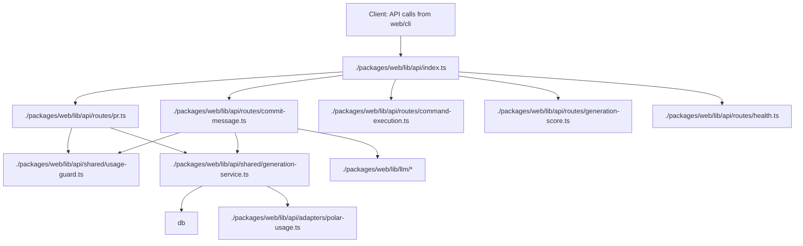

# Refactor `packages/web/lib/api.ts` and `packages/web/lib` structure with test-driven migration

Owner: satoshi
Expected completion date: 2026-02-26

## Context

The current `./packages/web/lib/api.ts` file has become large and highly coupled. It currently owns request handling, auth/session resolution, model/feature validation, quota checks, billing checks, generation execution, streaming orchestration, usage persistence, and response shaping in one place.

The current `./packages/web/lib` folder also mixes runtime concerns:

- API orchestration
- auth + billing glue
- LLM execution and diff preprocessing
- CLI terminal selector state machine
- small utilities (SEO, base URL, sitemap, daily limits)

The ask is to first structure tasks and test strategy before code changes.

## Current issues

1. `./packages/web/lib/api.ts` is too large and high coupling.
2. Shared logic (quota validation, streaming finalization, generation persistence, error mapping) is duplicated across routes in practice and hard to reason about.
3. Side effects (DB writes, Polar SDK calls, streaming events) are mixed with control logic and routing.
4. Current tests mostly cover non-API utility paths (`./packages/web/lib/auth-error.test.ts`, `./packages/web/lib/seo.test.ts`), leaving API behavior unprotected.
5. Refactoring without a test perimeter creates high risk of response contract regressions.

## Target architecture

### Desired tree (high level)

```text
./packages/web/lib
├── api
│   ├── index.ts
│   ├── middleware.ts
│   ├── routes
│   │   ├── command-execution.ts
│   │   ├── commit-message.ts
│   │   ├── pr.ts
│   │   ├── generation-score.ts
│   │   └── health.ts
│   ├── shared
│   │   ├── errors.ts
│   │   ├── validators.ts
│   │   ├── usage-guard.ts
│   │   ├── generation-service.ts
│   │   ├── stream-service.ts
│   │   └── helpers.ts
│   └── adapters
│       ├── polar-usage.ts
│       ├── db-usage.ts
├── auth
│   ├── auth.ts
│   ├── auth-client.ts
│   ├── auth-error.ts
│   ├── auth-log.ts
├── billing
│   ├── billing.ts
│   ├── auto-recharge.ts
├── cli
│   ├── terminal-selector.ts
│   ├── terminal-selector-effect.ts
├── llm
│   ├── commit-message.ts
│   ├── commit-message.server.ts
│   ├── pr-intent.ts
│   ├── pr-title-body.ts
│   ├── diff/
│   ├── index.ts
│   ├── llm-utils.ts
│   ├── models.ts
│   ├── types.ts
│   ├── gateway-metadata.ts
│   ├── mock.ts
├── util
│   ├── base-url.ts
│   ├── seo.ts
│   ├── sitemap-pages.ts
│   ├── daily-limit.ts
│   ├── account-deletion.ts
```

### Dependency goal (simplified)



## Design principle for split

1. Keep route-level behavior stable (HTTP method/path, status, body schema).
2. Keep side-effect boundaries explicit (db writes and external events in shared service layer).
3. Keep API file as wiring only: plugin + route registration + app composition.
4. Keep all new helper functions pure where possible.
5. Avoid semantic changes before structure stabilization.

## Test strategy

### Test coverage target

- Unit tests for pure logic first.
- Integration tests for route-level behavior and error contracts.
- Regression tests for streaming and billing-limit paths.
- OpenAPI output stability check.

### Primary test matrix

| Layer | Existing file(s) | Coverage target | Risk reduction |
|---|---|---|---|
| LLM diff preprocess | `./packages/web/lib/llm/diff/parser.ts`, `./packages/web/lib/llm/diff/classifier.ts`, `./packages/web/lib/llm/diff/prompt-builder.ts` | `parser/classifier/prompt-builder` test suite (fixtures for file type scoring + omit/primary selection) | High |
| Auth error mapping | `./packages/web/lib/auth-error.ts` | Expand and lock edge cases | Medium |
| Daily usage | `./packages/web/lib/daily-limit.ts` | Boundary tests for window and reset calculation | High |
| API auth+guard | `./packages/web/lib/api/*` | `401`, invalid model `400`, daily limit `402`, insufficient balance `402`, `200` success smoke | Critical |
| Generation persistence | `./packages/web/lib/api/shared/generation-service.ts` | Usage insert + generation insert invariants | High |
| Streaming route | `./packages/web/lib/api/routes/commit-message.ts` | SSE event order: commit-message → usage → provider-metadata, sanitize behavior | Critical |

### Test approach

- Keep behavior tests independent from implementation details.
- Use stubs/spies for `getAuth`, `getDb`, `getPolarClient`, and LLM generators before full split.
- Avoid full network calls in unit/integration tests.
- Add one contract-style test per endpoint response schema when possible.

## Implementation tasks

### Phase 0: Baseline and guardrails

- Add explicit issue list from `./packages/web/lib/api.ts` to include in notes.
- Add missing API-related test files in `./packages/web/lib/api/` or `./packages/web/lib/tests/`.
- Confirm current behavior baseline with a focused run of available test + lint in current branch.

### Phase 1: Extract shared API helpers

- Move model/validation helpers to `./packages/web/lib/api/shared/validators.ts`.
- Move streaming helpers and response formatters to `./packages/web/lib/api/shared/stream-service.ts`.
- Move usage guard logic to `./packages/web/lib/api/shared/usage-guard.ts`.
- Move error body generators to `./packages/web/lib/api/shared/errors.ts`.
- Add unit tests for each helper.

### Phase 2: Route extraction

- Create `./packages/web/lib/api/routes/commit-message.ts` and migrate both non-stream and stream endpoints.
- Create `./packages/web/lib/api/routes/pr.ts` and migrate PR title/body + intent endpoints.
- Create `./packages/web/lib/api/routes/command-execution.ts` with request capture and limits.
- Create `./packages/web/lib/api/routes/generation-score.ts`.
- Create `./packages/web/lib/api/routes/health.ts`.
- Keep signatures stable while wiring helper calls.

### Phase 3: API composition rewrite

- Create `./packages/web/lib/api/index.ts` as route composition and OpenAPI registration only.
- Reduce `./packages/web/lib/api.ts` to import and re-export from composition layer for compatibility.
- Validate app startup and route availability.

### Phase 4: lib domain reorganization

- Move auth-related files to `./packages/web/lib/auth/`.
- Move billing-related files to `./packages/web/lib/billing/`.
- Move shared utility files to `./packages/web/lib/util/`.
- Keep public imports stable using explicit re-export files during transition.
- Update internal imports and minimize path churn.

### Phase 5: Test expansion and hardening

- Add route-level integration tests for all `/api/v1/*` endpoints.
- Add contract checks for status and body consistency.
- Add/extend streaming tests for `/api/v1/commit-message/stream`.
- Add/extend OpenAPI snapshot test for endpoint metadata.
- Ensure all tests pass and capture results in task notes.

## Risks and mitigations

1. Breaking route behavior while moving code.
   - Mitigation: per-file behavior snapshots and endpoint contract tests before and after.
2. Import cycle or path mismatch after directory move.
   - Mitigation: one folder migration at a time and typecheck at each step.
3. Flaky tests due to async + streaming internals.
   - Mitigation: deterministic mocks and explicit AbortSignal completion.
4. Scope creep from broad cleanup.
   - Mitigation: do not perform unrelated refactors in same change.

## Acceptance criteria

- [x] `./packages/web/lib/api.ts` no longer contains endpoint business logic.
- [x] Route handlers are separated by endpoint responsibility.
- [x] Shared API utilities are extracted into `./packages/web/lib/api/shared/*`.
- [x] `./packages/web/lib` contains clear domain directories with stable ownership.
- [x] At least one test suite exists for each split layer: parser/classifier/prompt-builder, daily-limit, auth-error, and route-level API behaviors.
- [x] New tests cover 401/400/402/200 cases for generation routes.
- [x] Streaming route test asserts event shape order and final sanitize behavior.
- [x] `bun --cwd ./packages/web test` passes.
- [x] `bun --cwd ./packages/web typecheck` passes.
- [x] Task updates in this file include executed commands and results.

## Execution log and risk ledger (2026-02-19)

### Baseline checks
- Baseline files reviewed:
  - `packages/web/lib/api.ts`
  - `packages/web/lib/auth-error.test.ts`
  - `packages/web/lib/seo.test.ts`
  - `packages/web/openapi.json`
- Baseline command capture:
  - `bun --cwd /Users/satoshi/repo/toyamarinyon/ultrahope/packages/web test` → previously passing after route split stabilization (55 pass, 0 fail).
  - `bun --cwd /Users/satoshi/repo/toyamarinyon/ultrahope/packages/web typecheck` → initially failed due migration regressions, now pass.
  - `bun --cwd /Users/satoshi/repo/toyamarinyon/ultrahope/packages/web run generate:openapi` failed under bun/tsx IPC restrictions in this sandbox (`EPERM` on `/var/folders/.../tsx-*.pipe`); fallback command used below succeeded:
    - `cd /Users/satoshi/repo/toyamarinyon/ultrahope/packages/web && bun scripts/generate-openapi.ts`.

### Phase checkpoint matrix

| Phase | Pass/fail outcomes |
|---|---|
| Phase 1 — Shared helper extraction | ✅ pass: validators, errors, stream-service, usage-guard, generation-service extracted and covered with unit tests in `packages/web/lib/api/shared/*`. |
| Phase 2 — Route extraction | ✅ pass: `command-execution`, `commit-message`, `pr`, `generation-score`, `health` routes split and wired. |
| Phase 3 — API composition layer | ✅ pass: `packages/web/lib/api/index.ts` added and `packages/web/lib/api.ts` reduced to compatibility export. |
| Phase 4 — Domain reorganization | ✅ pass: `auth`, `billing`, `util` folders created and imports re-pointed. |
| Phase 5 — Test expansion/hardening | ✅ pass: route integration tests, stream regression assertions, and OpenAPI contract test added; new parser/classifier/prompt-builder/daily-limit coverage added. |
| Phase 6 — Finalization | ⚠️ command run completed with sandbox note: `bun --cwd ... run generate:openapi` blocked by local IPC restriction; equivalent Bun direct script execution updated `openapi.json` and `openapi.yaml` successfully. |

### Latest execution outcomes
- `bun --cwd /Users/satoshi/repo/toyamarinyon/ultrahope/packages/web test` → PASS (55 tests, 0 failed; includes API route, streaming, usage-guard, parser/classifier/prompt-builder, openapi contract).
- `bun --cwd /Users/satoshi/repo/toyamarinyon/ultrahope/packages/web typecheck` → PASS (no type errors).
- `cd /Users/satoshi/repo/toyamarinyon/ultrahope/packages/web && bun scripts/generate-openapi.ts` → PASS; regenerated:
  - `packages/web/openapi.json`
  - `packages/web/openapi.yaml`

## Notes

- Keep `./packages/web/lib/llm/*` behavior unchanged during API structural migration.
- Consider adding dependency injection hooks in `./packages/web/lib/api/shared/*` only if mocks become too invasive.
- Prefer incremental PRs: one phase per PR so regressions are traceable.
