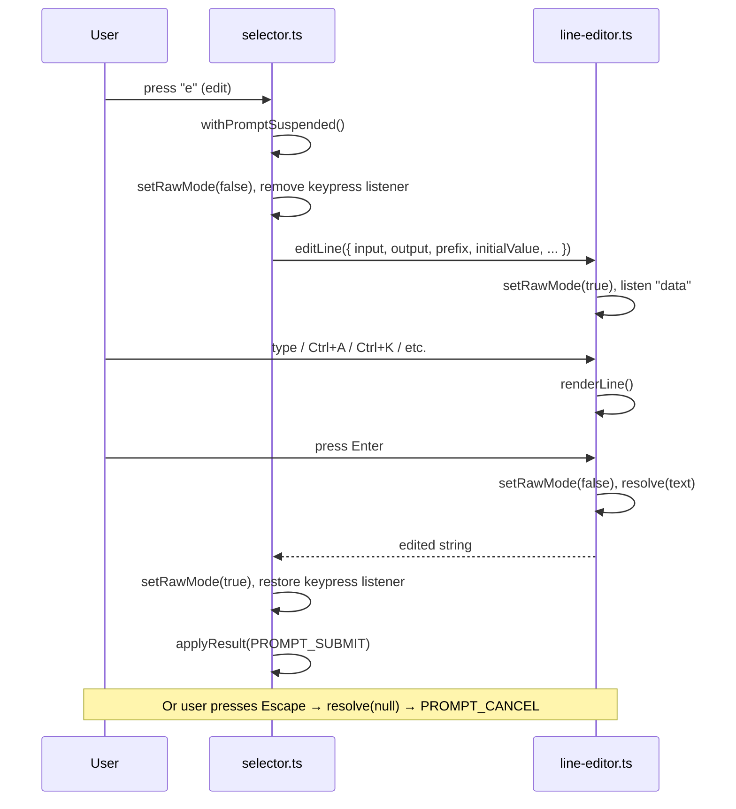

# Phase 1: Integrate Line Editor into Selector

> **Epic:** [AGENTS.md](./AGENTS.md)
> **Dependencies:** Phase 0 (line editor core must be complete)
> **Blocks:** None

## Objective

Replace the `readline.createInterface`-based `openInlinePrompt()` in `selector.ts` with
the new `editLine()` function from `line-editor.ts`. The edit and refine prompt flows must
work exactly as before, but with instant Escape response and CJK-correct cursor positioning.

## What You're Building



## Deliverables

### 1. Modify `packages/cli/lib/selector.ts`

#### 1a. Add import

```typescript
import { editLine } from "./line-editor";
```

#### 1b. Replace `openInlinePrompt()`

The current `openInlinePrompt()` (L487–L565) creates a `readline.createInterface`, writes
`initialValue`, and listens for `"line"` and `"keypress"` events. Replace the entire
function body with a call to `editLine()`.

**Current signature** (keep unchanged):
```typescript
const openInlinePrompt = async (
  prompt: string,
  options: InlinePromptOptions = {},
): Promise<string | null>
```

**New implementation:**
```typescript
const openInlinePrompt = async (
  prompt: string,
  options: InlinePromptOptions = {},
): Promise<string | null> => {
  const {
    initialValue = "",
    cancelOnQ = false,
    cancelOnEscape = true,
    trimResult = true,
    showPrompt = true,
    promptPrefix = "",
    helpText,
    helpSpacing = 0,
  } = options;

  const prefix = showPrompt ? ui.prompt(prompt) : promptPrefix || "";

  const result = await editLine({
    input: ttyReader,
    output: ttyWriter,
    prefix,
    initialValue,
    helpText,
    helpSpacing,
  });

  // editLine returns null on Escape/Ctrl+C
  if (result === null) {
    return null;
  }

  let value = result;
  if (trimResult) {
    value = value.trim();
  }
  if (cancelOnQ && value.toLowerCase() === "q") {
    return null;
  }
  return value;
};
```

#### 1c. Adjust `withPromptSuspended()`

The current `withPromptSuspended()` (L472–L485) does:
1. `setRawModeSafe(false)` — disable raw mode before prompt
2. Remove keypress listener
3. Run the task
4. Re-enable raw mode + keypress listener

Since `editLine()` manages its own raw mode internally, `withPromptSuspended` should still
disable raw mode before calling the task (so `editLine` starts from a clean state), and
re-enable it afterward. **No changes needed** — the current implementation already does
the right thing.

#### 1d. Remove unused `readline` import for `Key` type

After replacing `openInlinePrompt`, check if the `readline.Key` type is still used elsewhere
in the file. If `handleKeypress` still uses `readline.Key` (via `readline.emitKeypressEvents`),
keep the import. If it can be replaced with the raw key handler from list mode, that's a
future task — do NOT change list-mode handling in this phase.

### 2. Verify `openEditPrompt()` still works

The `openEditPrompt()` function (L588–L639) calls `openInlinePrompt()` with:
```typescript
{
  initialValue: selected.content,
  cancelOnEscape: true,
  showPrompt: false,
  promptPrefix: "    > ",
  helpText: `    ${ui.hint("enter: apply | esc: back to select a candidate")}`,
  helpSpacing: 2,
  trimResult: false,
}
```

After the replacement, this should work identically — `editLine` handles:
- `initialValue` → pre-fills the buffer
- Escape → returns `null`
- Enter → returns the text
- `prefix` → rendered before the text
- `helpText` + `helpSpacing` → rendered below

### 3. Verify `openRefinePrompt()` still works

The `openRefinePrompt()` function (L567–L586) calls `openInlinePrompt()` with:
```typescript
openInlinePrompt(
  "Enter refine instructions (e.g., more formal / shorter / Enter to clear, q=cancel): ",
  { cancelOnQ: true },
)
```

After the replacement:
- `showPrompt: true` (default) → `ui.prompt(prompt)` is used as prefix
- `cancelOnQ: true` → checked after `editLine` returns
- Escape → returns `null` → `PROMPT_CANCEL`

## Verification

1. **Typecheck:**
   ```bash
   cd opensrc/repos/github.com/toyamarinyon/ultrahope && bun run --filter cli typecheck
   ```

2. **Build:**
   ```bash
   cd opensrc/repos/github.com/toyamarinyon/ultrahope && bun run --filter cli build
   ```

3. **Manual E2E test** (requires API token):
   ```bash
   cd opensrc/repos/github.com/toyamarinyon/ultrahope
   eval "$(mise -E amp env)"
   # Stage some changes, then:
   bun run packages/cli/index.ts commit
   ```

   Test scenarios:

   | # | Action | Expected |
   |---|---|---|
   | 1 | Wait for candidates, press `e` | Edit prompt appears with selected message pre-filled |
   | 2 | In edit prompt, type ASCII text | Text inserted at cursor, cursor moves right |
   | 3 | In edit prompt, type Japanese (e.g., "修正") | Characters appear, cursor aligns correctly |
   | 4 | Ctrl+A then Ctrl+K | Cursor jumps to start, then kills to end |
   | 5 | Ctrl+Y | Yanks back the killed text |
   | 6 | Press Escape | Returns to list immediately (<50ms, no perceptible delay) |
   | 7 | Press `e` again, then Enter | Commits the edited message |
   | 8 | Press `r` for refine prompt | Refine prompt appears |
   | 9 | Type instructions, press Enter | Re-generation starts with refined candidates |
   | 10 | In refine prompt, type "q" + Enter | Returns to list (cancel) |

## Files to Create/Modify

| File | Action |
|---|---|
| `packages/cli/lib/selector.ts` | **Modify** (replace `openInlinePrompt` implementation, add import) |

## Done Criteria

- [ ] `openInlinePrompt()` uses `editLine()` instead of `readline.createInterface`
- [ ] Edit prompt (`e` key) works: pre-fills text, Enter confirms, Escape cancels instantly
- [ ] Refine prompt (`r` key) works: input → Enter submits, `q` cancels
- [ ] CJK input in edit prompt renders with correct cursor alignment
- [ ] Emacs keybindings (Ctrl+A/E/B/F/K/U/W/Y) work in edit prompt
- [ ] Typecheck passes
- [ ] Build succeeds
- [ ] No regressions in list-mode navigation (up/down/Enter/q/Escape)
- [ ] Update the status in [AGENTS.md](./AGENTS.md) to `✅ DONE`
