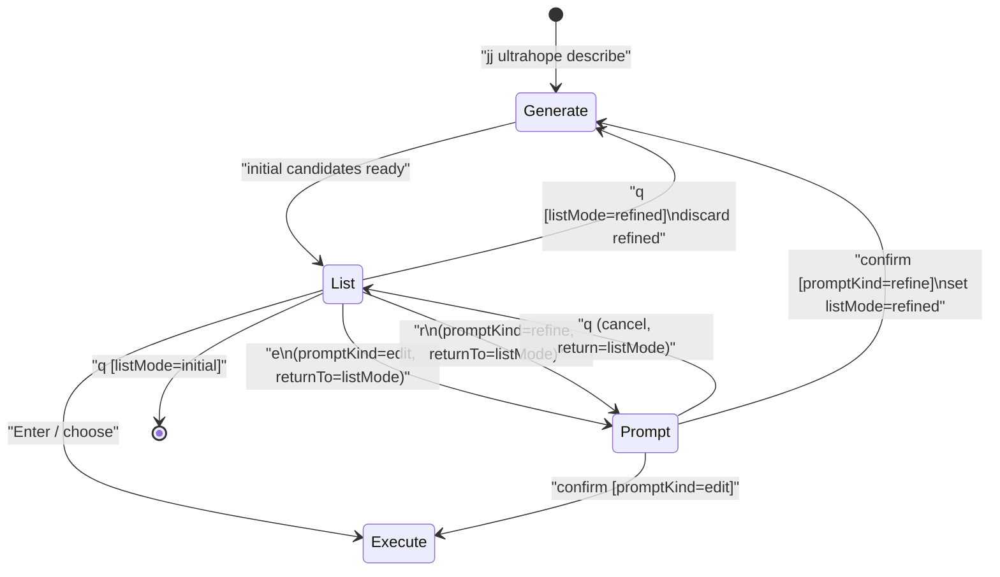

# AGENTS.md (packages/cli)

## API client types

Do not modify `src/lib/api-client.generated.ts` directly. To regenerate it, run:

```bash
bun --cwd packages/cli generate:client
```

## Refine UX state model

The `describe` flow should use an explicit UI state machine.  
The intended transitions are:



### Notes

- Keep state count minimal: `Generate`, `List`, `Prompt`.
- Context (not states):
  - `listMode ∈ {initial, refined}`
  - `selectedIndex: number`
  - `promptKind ∈ {edit, refine}`
  - `returnTo ∈ {initial, refined}` (captured when entering `Prompt`)
- `List` rendering depends on `listMode`.
  - `initial`: first generation candidates
  - `refined`: latest refine result candidates
- `Prompt` displays only target context:
  - `selectedIndex`, current candidate text, and the input line.
- `q` in `Prompt` returns to `List` without state reset (`listMode` preserved).
- `q` in `List`:
  - `listMode=initial` => exit
  - `listMode=refined` => discard refined and return to `initial` candidates
- On `Prompt` confirm:
  - `promptKind=edit` => execute selected message immediately
  - `promptKind=refine` => run generation, then return to `List` with `listMode=refined`
